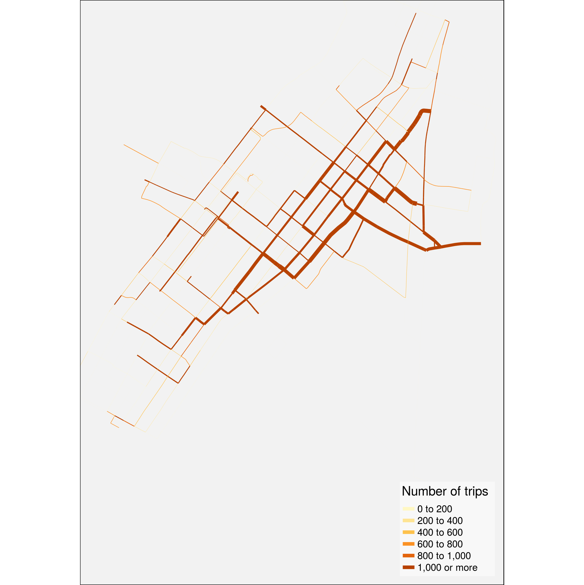

## 1. Introduction

`bikedata` is an R package for downloading and aggregating data from 
public bicycle hire, or bike share, systems. Although there are very many
public bicycle hire systems in the world ([see this wikipedia
list](https://en.wikipedia.org/wiki/List_of_bicycle-sharing_systems)),
relatively few openly publish data on system usage. The `bikedata` package aims
to enable ready importing of data from all systems which provide it, and will
be expanded on an ongoing basis as more systems publish open data. Cities and
names of associated public bicycle hire systems currently included in the
`bikedata` package, along with numbers of bikes and of docking stations, are:

City | Hire Bicycle System | Number of Bicycles | Number of Docking Stations
--- | --- | --- | ---
London, U.K. | [Santander Cycles](https://tfl.gov.uk/modes/cycling/santander-cycles) | 13,600 | 839
New York City NY, U.S.A. | [citibike](https://www.citibikenyc.com/) | 7,000 | 458
Chicago IL, U.S.A. | [Divvy](https://www.divvybikes.com/) | 5,837 | 576
Washingon DC, U.S.A. | [Capital BikeShare](https://www.capitalbikeshare.com/) | 4,457 | 406
Boston MA, U.S.A. | [Hubway](https://www.thehubway.com/) | 1,461 | 158
Los Angeles CA, U.S.A. | [Metro](https://bikeshare.metro.net/) | 1,000 | 65
Philadelphia PA, U.S.A. | [Indego](https://www.rideindego.com) | 600 | 60

All of these systems record and disseminate individual trip data, minimally
including the times and places at which every trip starts and ends. Some provide
additional anonymised individual data, typically including whether or not a user
is registered with the system and if so, additional data including age, gender,
and residential postal code.

Cities with extensively developed systems and cultures of public hire bicycles,
yet which do not provide (publicly available) data include:

City | Number of Bicycles | Number of Docking Stations
--- | --- | ---
Hangzhou, China | 78,000 | 2,965
Paris, France | 14,500 | 1,229
Barcelona, Spain | 6,000 | 424

The current version of the `bikedata` R package can be installed with the
following command:
```{r install1, eval = FALSE}
install.packages ('bikedata')
```
Or the development version with
```{r install2, eval = FALSE}
devtools::install_github ("mpadge/bikedata")
```
Once installed, it can be loaded in the usual way:
```{r, eval = TRUE}
library (bikedata)
```
```{r, eval = FALSE, echo = FALSE, message = FALSE}
devtools::load_all ()
```


## 2. Main Functions

The `bikedata` function `store_bikedata()` downloads individual trip data from
any or all or the above listed systems and stores them in an `SQLite3` database.
For example, the following line will download all data from the Metro
system of Los Angeles CA, U.S.A., and store them in a database named 'bikedb',
```{r store-la-data, eval = TRUE}
bikedb <- file.path (tempdir (), "bikedb.sqlite") # or whatever
store_bikedata (city = 'la', bikedb = bikedb, quiet = TRUE)
```
The function returns the number of trips added to the database.  Both the
downloaded data and the `SQLite3` database are stored by default in the
temporary directory of the current `R` session. The downloaded data are deleted
after having been loaded into the `SQLite3` database, and the database itself
is deleted on termination of the `R` session.  (All of these options may be
overridden as described below.)

Successive calls to `store_bikedata()` will append additional data to the same
database. For example, the following line will append all data from Chicago's
Divvy bike system from the year 2017 to the database created with the first
call above. 
```{r, eval = FALSE}
store_bikedata (bikedb = bikedb, city = 'divvy', dates = 2016, quiet = TRUE)
```
```{r, echo = FALSE}
3595383
```
The function again returns the number of trips *added* to the database, which
is now less than the total number of trips stored of:
```{r, eval = FALSE}
bike_db_totals (bikedb = bikedb)
```
```{r, echo = FALSE}
3726719
```

Having stored individual trip data in a database, the primary function of the
`bikedata` package is `bike_tripmat()`, which extracts aggregate numbers of
trips between all pairs of stations. The minimal arguments to this function are
the name of the database, and the name of a city for databases holding data from
multiple cities.
```{r, eval = FALSE}
tm <- bike_tripmat (bikedb = bikedb, city = 'la')
class (tm); dim (tm); sum (tm)
```
```{r}
```{r, echo = FALSE}
x <- "matrix"; y <- c (66, 66); z <- 131336
x; y; z
```
The Los Angeles Metro system has 66 docking stations, and there were a total of
131,336 individual trips up to April 2017.  Trip matrices can also be extracted
in long form using
```{r, eval = FALSE}
bike_tripmat (bikedb = bikedb, city = 'la', long = TRUE)
```
```{r, echo = FALSE}
n <- 4356
ss <- c (rep ('la3005', 10), rep (NA, n - 10))
es <- c ('la3005', 'la3006', 'la3007', 'la3008', 'la3009',
         'la3010', 'la3011', 'la3014', 'la3016', 'la3018', rep (NA, n - 10))
nt <- c (324, 105, 31, 173, 1, 9, 86, 49, 12, 39, rep (NA, n - 10))

tm <- tibble::tibble (start_station_id = ss,
                      end_station_id = es, numtrips = nt)
tm
```
Details of the docking stations associated with these trip matrices can be
obtained with
```{r, eval = FALSE}
bike_stations (bikedb = bikedb)
```
```{r, echo = FALSE}
n <- 662
id <- seq (n)
city <- rep ('la', n)
ids <- c ('la3005', 'la3006', 'la3007', 'la3008', 'la3009',
          'la3010', 'la3011', 'la3014', 'la3016', 'la3018', rep (NA, n - 10))
x <- c (-118.2590, -118.2567, -118.2546, -118.2627, -118.4728,
        -118.2549, -118.2680, -118.2372, -118.2416, -118.2601, rep (NA, n - 10))
y <- c (34.04855, 34.04554, 34.05048, 34.04661, 33.98738,
        34.03705, 34.04113, 34.05661, 34.05290, 34.04373, rep (NA, n - 10))
stations1 <- tibble::tibble (id = id, city = city, stn_id = ids,
                             name = rep ('', n), longitude = x, latitude = y)
stations1
```
Stations can also be extracted for particular cities:
```{r, eval = FALSE}
st <- bike_stations (bikedb = bikedb, city = 'ch')
```
For consistency and to avoid potential confusion of function names, most
functions in the `bikedata` package begin with the prefix `bike_` (except for
`store_bikedata()` and `dl_bikedata()`).

Databases generated by the `bikedata` package will generally be very large
(commonly at least several GB), and many functions may take considerable time to
execute.  It is nevertheless possible to explore package functionality quickly
through using the additional helper function, `bike_write_test_data()`. This
function uses the `bike_dat` data set provided with the package, which contains
details of 200 representative trips for each of the cities listed above. The
function writes these data to disk as `.zip` files which can then be read by the
`store_bikedata()` function.
```{r, eval = FALSE}
bike_write_test_data ()
store_bikedata (bikedb = 'testdb')
bike_summary_stats (bikedb = 'testdb')
```
The `.zip` files generated by `bike_write_test_data()` are created by default
in the `tempdir()` of the current `R` session, and so will be deleted on
session termination. Specifying any alternative `bike_dir` will create enduring
copies of those files in that location which ought to be deleted when finished.

The remainder of this vignette provides further detail on these three distinct
functional aspects of downloading, storage, and extraction of data.

## 3. Downloading Data

The `store_bikedata()` function demonstrated above automatically downloads data
and deletes the downloaded files once the data has been loaded into the
`SQLite3` database. Enduring copies of the raw data files may be created with
the function `dl_bikedata()`, and specifying a (non-default) location, such as,
```{r, eval = FALSE}
dl_bikedata (city = 'chicago', data_dir = '/data/bikedata/')
```

## 3.1 Downloading data for specific date ranges

Both `store_bikedata()` and `dl_bikedata()` accept an additional argument
(`dates`) specifying ranges of dates for which data should be downloaded and
stored.  The format of this argument is quite flexible so that,
```{r, eval = FALSE}
dl_bikedata (city = 'dc', dates = 16)
```
will download data from Washington DC's Capital Bikeshare system for all 12
months of the year 2016, while,
```{r, eval = FALSE}
dl_bikedata (city = 'ny', dates = 201604:201608)
```
will download New York City data from April to August (inclusively) for that
year. (Note that the default `data_dir` is the `tempdir()` of the current `R`
session, with downloaded files being deleted upon session termination.) Dates
can also be entered as character strings, with the following calls producing
results equivalent to the preceding call, 
```{r, eval = FALSE}
dl_bikedata (city = 'ny', dates = '2016/04:2016/08')
dl_bikedata (city = 'new york', dates = '201604:201608')
dl_bikedata (city = 'n.y.c.', dates = '2016-04:2016-08')
dl_bikedata (city = 'new', dates = '2016 Apr-Aug')
```
The only strict requirement for the format of `dates` is that years must be
specified before months, and that some kind of separator must be used between
the two except when formatted as single six-digit numbers or character strings
(YYYYMM).  The arguments `city = 'new'` and `city = 'CI'` in the final call are
sufficient to uniquely identify New York City's citibike system.

If files have been previously downloaded to a nominated directory, then calling
the `dl_bikedata()` function will only download those data files that do not
already exist. This function may thus be used to periodically refresh the
contents of a nominated directory as new data files become available.

Some systems disseminate data on quarterly (Washington DC and Los Angeles) or
bi-annual (Chicago) bases. The `dates` argument in these cases is translated to
the appropriate quarterly or bi-annual files. These are then downloaded as
single files, and thus the following call
```{r, eval = FALSE}
dl_bikedata (city = 'dc', dates = '2016.03-2016.05')
```
will actually download data for the entire first and second quarters of 2016.
Even though the database constructed with `store_bikedata()` will then contain
data beyond the specified date ranges, it is nevertheless possible to obtain a
trip matrix corresponding to specific dates and/or times, as described below.

## 4. Storing Data

As mentioned above, individual trip data are stored in a single `SQLite3`
database, created by default in the temporary directory of the current `R`
session. Specifying a path for the `bikedb` argument in the `store_bikedata()`
function will create a database that will remain in that location until
explicitly deleted. 

The nominated database is created if it does not already exist, otherwise
additional data are appended to the existing database. As described above, the
same `dates` argument can be passed to both `dl_bikedata()` and
`store_bikedata()` to download data within specified ranges of dates.

Both `dl_bikedata()` and `store_bikedata()` are primarily intended to be used to
download data for specified cities. It is possible to use the latter to store
all data for all cities simply by calling `store_bikedata (bikedb = bikedb)`,
however doing so will request confirmation that data from *all* cities really
ought to be downloaded and/or stored.  Intended general usage of the
`store_bikedata()` function is illustrated in the following line:
```{r, eval = FALSE}
ntrips <- store_bikedata (bikedb = bikedb, city = 'ny',
                          dates = '2014 aug - 2015 Dec')
```
Or to load data which have been previously downloaded using `dl_bikedata()`:
```{r, eval = FALSE}
ntrips <- store_bikedata (bikedb = bikedb, city = 'ny',
                          data_dir = '/data/stored/here')
```
As described above, the function `dl_bikedata()` may be used to periodically
refresh downloaded files when new data become available. The `store_bikedata()`
function provides a similar capability. When called without specifying
`data_dir`, the function will download only those files which have not been
previously stored in the database, whereas when called with a specific
`data_dir`, the function will download any files not present in the nominated
directory and load them in to the database.

In short, the `store_bikedata()` function may be repeatedly called to load only
those data published since the last time the function was called, while
enduring copies of the raw data files on individual trips may be periodically
refreshed with `dl_bikedata()`, and the associated directory specified in the
call to `store_bikedata()` to load only recently added files.


### 4.1 Database Indexes

The `store_bikedata()` function also has a default option to create indexes for
more efficient data extraction. Indexes are always created for cities, with the
`create_index = TRUE` option creating additional indexes for dates and times.
Setting this parameter to `FALSE` will enable faster initial storage of data,
yet is likely to lead to slower aggregation of data based on dates and times
(see below). It is therefore recommended to set this option to `FALSE` only when
subsequent data aggregation will **not** be based on dates or times.

If data are to be stored for multiple cities, then database construction will be
speed up by using `store_bikedata (..., create_index = FALSE)` to read all but
the last city. Setting `create_index = TRUE` when reading the final city will
then create the necessary indexes just one time.

## 5. Accessing Aggregate Data

### 5.1 Origin-Destination Matrices

As briefly described in the introduction, the primary function for extracting
aggregate data from the `SQLite3` database established with `store_bikedata()`
is `bike_tripmat()`. With the single mandatory argument naming the database,
this function returns a matrix of numbers of trips between all pairs of
stations.  Trip matrices can be returned either in square form (the default),
with both rows and columns named after the bicycle docking stations and matrix
entries tallying numbers of rides between each pair of stations, or in long form
by requesting `bike_tripmat (..., long = TRUE)`. The latter case will return a
[`tibble`](https://cran.r-project.org/package=tibble) with the three columns of
`station_station_id`, `end_station_id`, and `number_trips`, as demonstrated
above.

The data for the individual stations associated with the trip matrix can be
extracted with `bike_stations()`, which returns a `tibble` containing the 6
columns of city, station code, station name, longitude, and latitude. Station
codes are specified by the operators of each system, and pre-pended with a
2-character city identifier (so, for example, the first of the stations shown
above is `la3005`). The `bike_stations()` function will generally return all
operational stations within a given system, which `bike_tripmat()` will return
only those stations in operation during the requested time period. The previous
call stored all data from Chicago's Divvybikes system for the year 2016 only, so
the trip matrix has less entries than the full stations table, which includes
stations added since then.
```{r, eval = FALSE}
dim (bike_tripmat (bikedb = bikedb, city = 'ch'))
```
```{r, echo = FALSE}
c (581, 581)
```
```{r, eval = FALSE}
dim (bike_stations (bikedb = bikedb, city = 'ch'))
```
```{r, echo = FALSE}
c (596, 6)
```


#### 5.1.1. Temporal filtering of trip matrices

Trip matrices can also be extracted for particular dates, times, and days of
the week, through specifying one or more of the optional arguments:

1. `start_date`
2. `end_date`
3. `start_time`
4. `end_time`
5. `weekday`

Arguments may in all cases be specified in a range of possible formats as long
as they are unambiguous, and as long as 'larger' units precede 'smaller' units
(so years before months before days, and hours before minutes before seconds).
Acceptable formats may be illustrated through specifying a list of arguments to
be passed to `bike_tripmat()`. This is done here through passing two lists to
`bike_tripmat()` via `do.call()`, enabling the second list (`args1`) to be
subsequently modified.
```{r, eval = FALSE}
args0 <- list (bikedb = bikedb, city = 'ny', args)
args1 <- list (start_date = 16, end_time = 12, weekday = 1)
tm <- do.call (bike_tripmat, c (args0, args1))
```
In `args1`, a two-digit `start_date` (or `end_date`) is interpreted to represent
a year, while a one- or two-digit `_time` is interpreted to represent an hour.
A value of `end_time = 24` is interpreted as `end_time = '23:59:59'`, while a
value of `_time = 0` is interpreted as `00:00:00`.  The following further
illustrate the variety of acceptable formats,
```{r, eval = FALSE}
args1 <- list (start_date = '2016 May', end_time = '12:39', weekday = 2:6)
args1 <- list (end_date = 20160720, end_time = 123915, weekday = c ('mo', 'we'))
args1 <- list (end_date = '2016-07-20', end_time = '12:39:15', weekday = 2:6)
```
Both `_date` and `_time` arguments may be specified in either `character` or
`numeric` forms; in the former case with arbitrary (or no) separators.
Regardless of format, larger units must precede smaller units as explained
above.

Weekdays may specified as characters, which must simply be unambiguous and (in
admission of currently inadequate internationalisation) correspond to standard
English names. Minimal character specifications are thus `'so', 'm', 'tu', 'w',
'th', 'f', 'sa'`. The value of `weekday = 1` denotes Sunday, so `weekdays =
2:6` denote the traditional working days, Monday to Friday, while weekends may
be denoted with `weekdays = c ('sa', 'so')` or `weekdays = c (1, 7)`.


#### 5.1.2. Demographic filtering of trip matrices

As described at the outset, the bicycle hire systems of several cities provide
additional demographic information including whether or not cyclists are
registered with the system, and if so, additional information including birth
years and genders. Note that the provision of such information is voluntary, and
that no providers can or do guarantee the accuracy of their data.

Those systems which provide demographic information are listed with the
function `bike_demographic_data()`, which also lists the nominal kinds of
demographic data provided by the different systems.
```{r}
bike_demographic_data ()
```
Data can then be filtered by demographic parameters with additional optional
arguments to `bike_tripmat()` of,

1. `registered` (`TRUE/FALSE`, `'yes'/'no'`, 0/1)
2. `birth_year` (as one or more four-digit numbers or character strings)
3. `gender` ('m/f/.', 'male/female/other')

Users are not required to specify genders, and any values of `gender` other than
character strings beginning with either `f` or `m` (case-insensitive) will be
interpreted to request non-specified or alternative values of gender.  Note
further than many systems offer a range of potential birth years starting from a
default value of 1900, and there are consequently a significant number of
cyclists who declare this as their birth year.

It is of course possible to combine all of these optional parameters in a
single query. For example,
```{r, eval = FALSE}
tm <- bike_tripmat (bikedb = bikedb, city = 'ny', start_date = 2016,
        start_time = 9, end_time = 24, weekday = 2:6, gender = 'xx', 
        birth_year = 1900:1950)
```
The value of `gender = 'xx'` will be interpreted to request data from all
members with nominal alternative genders.  As demographic data are only given
for registered users, the `registered` parameter is redundant in this query.

#### 5.1.3. Standardising trip matrices by durations of operation

Most bicycle hire systems have progressively expanded over time through ongoing
addition of new docking stations. Total numbers of counts within a trip matrix
will thus be generally less for more recently installed stations, and more for
older stations. The `bike_tripmat()` function has an option, `standardise =
FALSE`. Setting `standardise = TRUE` allows trip matrices to be standardised for
durations of station operation, so that numbers of trips between any pair of
stations reflect what they would be if all stations had been in operation for
the same duration.

Standardisation implements a linear scaling of total numbers of trips to and
from each station according to total durations of operation, with counts in
the final trip matrix scaled to have the same total number of trips as the
original matrix.  This standardisation has two immediate consequences:

1. Numbers of trips between any pair of stations will not necessarily be integer
   values, but are rounded for the sake of sanity to three digits, corresponding
   to the maximal likely precision attainable for daily differences in operating
   durations;
2. Trip numbers will generally not equal actual observed numbers. Counts for the
   longest operating durations will be lower than actually recorded, while
   counts for more recent stations will be greater than observed values.

The `standardise` option nevertheless enables travel patterns between different
(groups of) stations to be statistically compared in a way that is free of the
potentially confounding influence of differing durations of operation.


### 5.2. Station Data

Data on docking stations may be accessed with the function `bike_stations()`
as demonstrated above:
```{r, eval = FALSE}
bike_stations (bikedb = bikedb)
```
```{r, echo = FALSE}
stations1
```
This function returns a [`tibble`](https://cran.r-project.org/package=tibble)
detailing the names and locations of all bicycle stations present in the
database. Station data for specific cities may be extracted through specifying
an additional `city` argument.
```{r, eval = FALSE}
bike_stations (bikedb = bikedb, city = 'ch')
```
```{r, echo = FALSE}
n <- 596
id <- 66 + seq (n)
city <- rep ('ch', n)
ids <- c ('ch456', 'ch101', 'ch109', 'ch21', 'ch80',
          'ch346', 'ch341', 'ch444', 'ch511', 'ch376', rep (NA, n - 10))
nms <- c ('2112 W Peterson Ave', '63rd St Beach', '900 W Harrison St',
            'Aberdeen St & Jackson Blvd', 'Aberdeen St & Monroe St', 
            'Ada St & Washington Blvd', 'Adler Planetarium', 
            'Albany Ave & 26th St', 'Albany Ave & Bloomingdale Ave', 
            'Artesian Ave & Hubbard St', rep (NA, n - 10))
x <- c (-87.68359, -87.57612, -87.65002, -87.65479, -87.65393,
        -87.66121, -87.60727, -87.70201, -87.70513, -87.68822, rep (NA, n - 10))
y <- c (41.99118, 41.78102, 41.87468, 41.87773, 41.88046,
        41.88283, 41.86610, 41.84448, 41.91403, 41.88949, rep (NA, n - 10))
stations2 <- tibble::tibble (id = id, city = city, stn_id = ids,
                             name = nms, longitude = x, latitude = y)
stations2
```


### 5.3. Summary Statistics

`bikedata` provides a number of helper functions for extracting summary
statistics from the `SQLite3` database. The function `bike_summary_stats
(bikedb)` generates an overview table. (This function may take some time to
execute on large databases.)

```{r, eval = FALSE}
bike_summary_stats ('bikedb')
```
```{r, echo = FALSE}
ntr <- c (3726719, 3595383, 131336)
nst <- c (662, 596, 66)
startd <- c ('2016-01-01 00:07:00', '2016-01-01 00:07:00', 
             '2016-07-07 04:17:00')
endd <- c ('2017-03-31 23:45:00', '2016-12-31 23:57:52',
           '2017-03-31 23:45:00')
fls <- c (NA, TRUE, TRUE)
tbl <- tibble::tibble (num_trips = ntr, num_stations = nst,
                       first_trip = as.factor (startd), 
                       last_trip = as.factor (endd), latest_files = fls)
tbl
```
Additional helper functions provide individual components from this summary
data, and will generally do so notably faster for large databases than the above
function. The primary individual function is `bike_db_totals()`, which can be
used to extract total numbers of either trips (the default) or stations (by
specifying `trips = FALSE`) from the entire database or from specific cities. 
```{r, eval = FALSE}
bike_db_totals (bikedb = bikedb)
```
```{r, echo = FALSE}
3726719
```
```{r, eval = FALSE}
bike_db_totals (bikedb = bikedb, city = "ch")
```
```{r, echo = FALSE}
3595383
```
```{r, eval = FALSE}
bike_db_totals (bikedb = bikedb, city = "la")
```
```{r, echo = FALSE}
131336
```
```{r, eval = FALSE}
bike_db_totals (bikedb = bikedb, trips = FALSE)
```
```{r, echo = FALSE}
662
```
```{r, eval = FALSE}
bike_db_totals (bikedb = bikedb, trips = FALSE, city = "ch")
```
```{r, echo = FALSE}
596
```
```{r, eval = FALSE}
bike_db_totals (bikedb = bikedb, trips = FALSE, city = "la")
```
```{r, echo = FALSE}
66
```
The other primary components of `bike_summary_stats()` are the dates of first
and last trips for the entire database and for individual cities. These dates
can be obtained directly with the function `bike_datelimits()`:
```{r, eval = FALSE}
bike_datelimits (bikedb = bikedb)
```
```{r, echo = FALSE}
c ('first' = "2016-01-01 00:07:00", 'last' = "2017-03-31 23:45:00")
```
```{r, eval = FALSE}
bike_datelimits (bikedb = bikedb, city = 'ch')
```
```{r}
c ('first' = "2016-01-01 00:07:00", 'last' = "2016-12-31 23:57:52")
```
A helper function is also provided to determine whether the files stored in the
database represent the latest available files.
```{r, eval = FALSE}
bike_latest_files (bikedb = bikedb)
```
```{r}
c ('la' = TRUE, 'ch' = TRUE)
```
(At the time of this vignette, Chicago data for the first quarter of 2017 have
not been released, and thus 2016 data are the latest.)


### 5.4. Time Series of Daily Trips

The `bike_tripmat()` function provides a *spatial* aggregation of data. An
equivalent *temporal* aggregation is provided by the function
`bike_daily_trips()`, which aggregates trips for individual days.

```{r, eval = FALSE}
bike_daily_trips (bikedb = bikedb, city = 'ch')
```
```{r, echo = FALSE}
n <- 366
dates <- c ('2016-01-01', '2016-01-02', '2016-01-03', '2016-01-04',
            '2016-01-05', '2016-01-06', '2016-01-07', '2016-01-08',
            '2016-01-09', '2016-01-10', rep (NA, n - 10))
nt <- c (935, 1421, 1399, 3833, 4189, 4608, 5028, 3425, 1733, 993,
         rep (NA, n - 10))
tibble::tibble (date = dates, numtrips = nt)
```
Daily trip counts can also be standardised to account for differences in numbers
of stations within a system as for trip matrix standardisation described above.
Such standardisation is helpful because daily numbers of trips will generally
increase with increasing numbers of stations. Standardisation returns a time
series of daily trips reflecting what they would be if all system stations had
been in operation throughout the entire time.
```{r, eval = FALSE}
bike_daily_trips (bikedb = bikedb, city = 'ch', standardise = TRUE)
```
```{r, echo = FALSE}
nt <- c (2468.925, 2481.939, 2200.766, 5509.787, 5884.207, 6298.229, 6630.111,
         4476.455, 2265.021, 1297.845, rep (NA, n - 10))
tibble::tibble (date = dates, numtrips = nt)
```
This [`tibble`](https://cran.r-project.org/package=tibble) reveals two points of
immediate note:

1. Trip numbers are no longer integer values, but are rounded to three decimal
   places to reflect the highest plausible numerical accuracy; and
2. Standardised trip numbers are considerably higher for the initial values,
   because of expansion of the Chicago Divvy system throughout the year 2016.


## 6. Direct database access


Although the `bikedata` package aims to circumvent any need to access the
database directly, through providing ready extraction of trip data for most
analytical or visualisation needs, direct access may be achieved either using
the convenient `dplyr` functions, or the more powerful functionality provided
by the `RSQLite` package.

The following code illustrates access using the `dplyr` package:
```{r, eval = FALSE}
db <- dplyr::src_sqlite (bikedb, create=F)
dplyr::src_tbls (db)
```
```{r}
c ("datafiles", "stations", "trips")
```
```{r, eval = FALSE}
dplyr::collect (dplyr::tbl (db, 'datafiles'))
```
```{r, echo = FALSE}
city <- c ('la', 'la', 'la', 'ch', 'ch')
nms <- c ('la_metro_gbfs_trips_Q1_2017.zip', 'MetroBikeShare_2016_Q3_trips.zip',
          'Metro_trips_Q4_2016.zip', 'Divvy_Trips_2016_Q1Q2.zip',
          'Divvy_Trips_2016_Q3Q4.zip')
tibble::tibble (id = 0:4, city = city, name = nms)
```
```{r, eval = FALSE}
dplyr::collect (dplyr::tbl (db, 'stations'))
```
```{r, echo = FALSE}
stations1
```
```{r, eval = FALSE}
dplyr::collect (dplyr::tbl (db, 'trips'))
```
```{r, echo = FALSE}
n <- 100000
id <- seq (n)
city <- rep ('la', n)
dur <- c (480, 720, 1020, 300, 300, 1200, 720, 2880, 2820, 1500, 
          rep (NA, n - 10))
st <- c ('2017-01-01 00:15:00', '2017-01-01 00:24:00', '2017-01-01 00:28:00',
         '2017-01-01 00:38:00', '2017-01-01 00:38:00', '2017-01-01 00:39:00',
         '2017-01-01 00:43:00', '2017-01-01 00:56:00', '2017-01-01 00:57:00',
         '2017-01-01 01:54:00', rep (NA, n - 10))
et <- c ('2017-01-01 00:23:00', '2017-01-01 00:36:00', '2017-01-01 00:45:00',
         '2017-01-01 00:43:00', '2017-01-01 00:43:00', '2017-01-01 00:59:00',
         '2017-01-01 00:55:00', '2017-01-01 01:44:00', '2017-01-01 01:44:00',
         '2017-01-01 02:19:00', rep (NA, n - 10))
nachr <- rep ('a', n)
naint <- rep (1L, n)
tibble::tibble (id = id, city = city, trip_duration = dur,
                start_time = st, stop_time = et,
                start_station_id = nachr, end_station_id = nachr,
                bike_id = nachr, user_type = nachr, birth_year = naint,
                gender = naint)
warning ('Only first 100,000 results retrieved. Use n = Inf to retrieve all.',
         call. = FALSE)
```
The [`RSQLite`](https://cran.r-project.org/package=RSQLite) package enables more
complex queries to be constructed. The names of stations, for example, could be
extracted using the following code
```{r, eval = FALSE}
db <- RSQLite::dbConnect(SQLite(), bikedb, create = FALSE)
qry <- "SELECT stn_id, name FROM stations WHERE city = 'ch'"
stns <- RSQLite::dbGetQuery(db, qry)
RSQLite::dbDisconnect(db)
head (stns)
```
```{r, echo = FALSE}
data.frame (stn_id = c ('ch456', 'ch101', 'ch109', 'ch21', 'ch80', 'ch346'),
            name = c ('2112 W Peterson Ave', '63rd St Beach', 
                      '900 W Harrison St', 'Aberdeen St & Jackson Blvd', 
                      'Aberdeen St & Monroe St', 'Ada St & Washington Blvd'))
```
Many of the queries used in the `bikedata` package are constructed in this way
using the `RSQLite` interface.


## 7. Visualisation of bicycle trips

The `bikedata` package does not provide any functions enabling visualisation of
aggregate trip data, both because of the primary focus on enabling access and
aggregation in the simplest practicable way, and because of the myriad
different ways users of the package are likely to want to visualise the data.
This section therefore relies on other packages to illustrate some of the ways
in which trip matrices may be visualised.

### 7.1 Visualisation using R Base functions

The simplest spatial visualisation involves connecting the geographical
coordinates of stations with straight lines, with numbers of trips represented
by some characteristics of the lines connecting pairs of stations, such as
thickness or colours.  This can be achieved with the following code, which also
illustrates that it is generally more useful for visualisation purposes to
extract trip matrices in long rather than square form.
```{r plot-la-out, echo = TRUE, eval = FALSE}
stns <- bike_stations (bikedb = bikedb, city = 'la')
ntrips <- bike_tripmat (bikedb = bikedb, city = 'la', long = TRUE)
x1 <- stns$longitude [match (ntrips$start_station_id, stns$stn_id)]
y1 <- stns$latitude [match (ntrips$start_station_id, stns$stn_id)]
x2 <- stns$longitude [match (ntrips$end_station_id, stns$stn_id)]
y2 <- stns$latitude [match (ntrips$end_station_id, stns$stn_id)]
# Set plot area to central region of bike system
xlims <- c (-118.27, -118.23)
ylims <- c (34.02, 34.07)
plot (stns$longitude, stns$latitude, xlim = xlims, ylim = ylims)
cols <- rainbow (100)
nt <- ceiling (ntrips$numtrips * 100 / max (ntrips$numtrips))
for (i in seq (x1))
    lines (c (x1 [i], x2 [i]), c (y1 [i], y2 [i]), col = cols [nt [i]],
        lwd = ntrips$numtrips [i] * 10 / max (ntrips$numtrips))
```
```{r plot-la, echo = FALSE, eval = TRUE}
# For some reason the R CMD build version loses one longitude in stns which
# mucks up the plot
stns <- bike_stations (bikedb = bikedb, city = 'la')
ntrips <- bike_tripmat (bikedb = bikedb, city = 'la', long = TRUE)
x1 <- stns$longitude [match (ntrips$start_station_id, stns$stn_id)]
y1 <- stns$latitude [match (ntrips$start_station_id, stns$stn_id)]
x2 <- stns$longitude [match (ntrips$end_station_id, stns$stn_id)]
y2 <- stns$latitude [match (ntrips$end_station_id, stns$stn_id)]
# Set plot area to central region of bike system
xlims <- c (-118.27, -118.23)
ylims <- c (34.02, 34.07)
plot (stns$longitude, stns$latitude, xlim = xlims, ylim = ylims)
cols <- rainbow (100)
nt <- ceiling (ntrips$numtrips * 100 / max (ntrips$numtrips))
for (i in seq (x1))
    lines (c (x1 [i], x2 [i]), c (y1 [i], y2 [i]), col = cols [nt [i]],
        lwd = ntrips$numtrips [i] * 10 / max (ntrips$numtrips))
```

### 7.2 A More Sophisticated Visualisation

The following code illustrates a more sophisticated approach to plotting such
data, using routines from the packages `osmdata`, `stplanr`, and `tmap`. Begin
by extracting the street network for Los Angeles using the `osmdata` package.
Current `stplanr` routines require spatial objects of class
[`sp`](https://cran.r-project.org/package=sp) rather than
[`sf`](https://cran.r-project.org/package=sf).
```{r get-la-highways, eval = FALSE}
library (magrittr)
xlims_la <- range (stns$longitude, na.rm = TRUE)
ylims_la <- range (stns$latitude, na.rm = TRUE)
# expand those limits slightly
ex <- 0.1
xlims_la <- xlims_la + c (-ex, ex) * diff (xlims_la)
ylims_la <- ylims_la + c (-ex, ex) * diff (ylims_la)
bbox <- c (xlims_la [1], ylims_la [1], xlims_la [2], ylims_la [2])
bbox <- c (xlims [1], ylims [1], xlims [2], ylims [2])
# Then the actual osmdata query to extract all OpenStreetMap highways
highways <- osmdata::opq (bbox = bbox) %>%
    osmdata::add_osm_feature (key = 'highway') %>%
    osmdata::osmdata_sp (quiet = FALSE)
```
For compatibility with current `stplanr` code, the `stns` table also needs to be
converted to a `SpatialPointsDataFrame` and re-projected.
```{r convert-stns-to-spdf, eval = FALSE}
stns_tbl <- bike_stations (bikedb = bikedb)
stns <- sp::SpatialPointsDataFrame (coords = stns_tbl[,c('longitude','latitude')],
                                    proj4string = sp::CRS("+init=epsg:4326"), 
                                    data = stns_tbl)
stns <- sp::spTransform (stns, highways$osm_lines@proj4string)
```
These data can then be used to create an `stplanr::SpatialLinesNetwork` which
can be used to trace the routes between bicycle stations along the street
network.  This first requires mapping the bicycle station locations to the
nearest nodes in the street network, and converting the start and end stations
of the `ntrips` table to corresponding rows in the street network data frame.
```{r map-stns-to-streetnet, eval = FALSE}
la_net <- stplanr::SpatialLinesNetwork (sl = highways$osm_lines)
# Find the closest node to each station
nodeid <- stplanr::find_network_nodes (la_net, stns$longitude, stns$latitude)
# Convert start and end station IDs in trips table to node IDs in `la_net`
startid <- nodeid [match (ntrips$start_station_id, stns$stn_id)]
endid <- nodeid [match (ntrips$end_station_id, stns$stn_id)]
ntrips$start_station_id <- startid
ntrips$end_station_id <- endid
```
The aggregate trips on each part of the network using the `sum_network_lines()`
function which is part of the current development version of `stplanr`.
```{r, eval = FALSE}
bike_usage <- stplanr::sum_network_links (la_net, data.frame (ntrips))
```
Then finally plot it with `tmap`, again trimming the plot using the previous
limits to exclude a very few isolated stations
```{r plot-tmat, eval = FALSE}
tmap::tm_shape (bike_usage, xlim = xlims, ylim = ylims, is.master=TRUE) + 
    tmap::tm_lines (col="numtrips", lwd="numtrips", title.col = "Number of trips",
                    breaks = c(0, 200, 400, 600, 800, 1000, Inf),
                    legend.lwd.show = FALSE, scale = 5) + 
    tmap::tm_layout (bg.color="gray95", legend.position = c ("right", "bottom"),
                     legend.bg.color = "white", legend.bg.alpha = 0.5)
#tmap::save_tmap (filename = "la_map.png")
```

